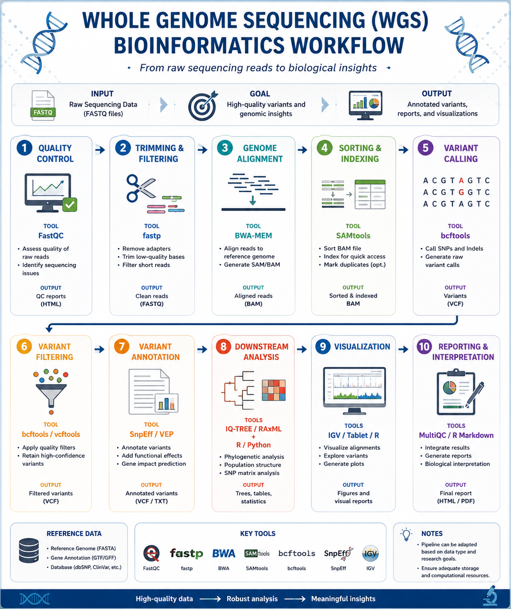

# mycobacteriumtuberculosis-wgs-analysis
Bioinformatics workflow for whole genome sequencing data processing and analysis
# Whole Genome Sequencing (WGS) Bioinformatics Pipeline

## Overview

This repository provides a reproducible workflow for whole genome sequencing (WGS) data analysis, from raw sequencing reads to downstream genomic interpretation.

---

## Workflow



---

## Pipeline

1. Raw sequencing data (FASTQ)
2. Quality control (FastQC)
3. Read trimming (fastp)
4. Genome alignment (BWA-MEM)
5. BAM processing (SAMtools)
6. Variant calling (bcftools)
7. Variant annotation (SnpEff)
8. Downstream analysis
9. Visualization
10. Reporting

---

## Bioinformatics Tools

| Step | Tool |
|------|------|
| Quality Control | FastQC |
| Trimming | fastp |
| Alignment | BWA-MEM |
| BAM Processing | SAMtools |
| Variant Calling | bcftools |
| Annotation | SnpEff |
| Visualization | IGV |

---

## Folder Structure

```
mycobacteriumtuberculosis-wgs-analysis
│
├── docs
├── scripts
├── data
├── results
└── README.md
```

---

## References

- FastQC
- BWA
- SAMtools
- bcftools
- SnpEff
